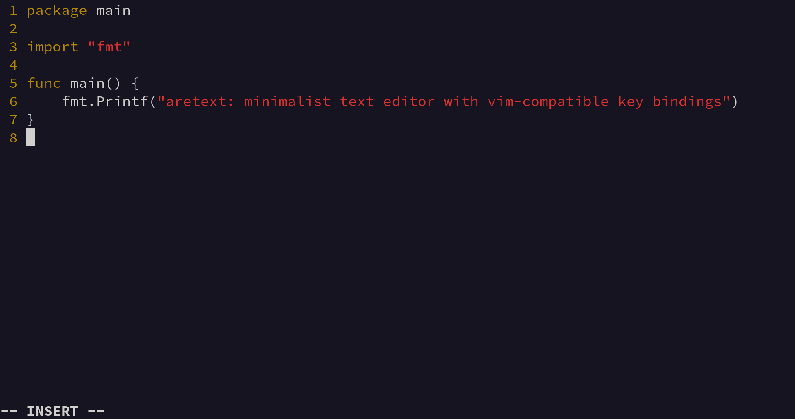

aretext
=======

Minimalist text editor with vim-compatible key bindings.

See the [User Documentation](https://aretext.org/docs/) to get started!

Key Features
------------

-	**Vim-compatible**: edit efficiently with vim-compatible\* key bindings.
-	**Built-in fuzzy search**: quickly find files and commands.
-	**Intuitive config**: easily customize settings in a single YAML file.

*\* Aretext key bindings are compatible with vim's normal, insert, and visual modes. See [Command Reference](https://aretext.org/docs/command-reference.html) for details.*

Project Status: Beta
--------------------

-	The user interface is stable, and I am using it as my primary editor.
-	Syntax highlighting is available for a few languages.
-	Many important vim commands are supported, but there are still many more to add!

See [open milestones](https://github.com/aretext/aretext/milestones?direction=asc&sort=title&state=open) for the current roadmap.

Getting Started
---------------

-	[Install](https://aretext.org/docs/install.html)
-	[Quickstart](https://aretext.org/docs/quickstart.html)
-	[User Documentation](https://aretext.org/docs/)

Contributing
------------

Contributions are welcome! Please read the [Contribution Guidelines](CONTRIBUTING.md) to get started.

Developing
----------

See [DEVELOPING](DEVELOPING.md) for steps to build, test, and debug aretext.

Copyright and License
---------------------

Copyright (C) 2021 Will Daly

This program is free software: you can redistribute it and/or modify it under the terms of the GNU General Public License as published by the Free Software Foundation, either version 3 of the License, or (at your option) any later version.

This program is distributed in the hope that it will be useful, but WITHOUT ANY WARRANTY; without even the implied warranty of MERCHANTABILITY or FITNESS FOR A PARTICULAR PURPOSE. See the GNU General Public License for more details.

You should have received a copy of the GNU General Public License along with this program. If not, see https://www.gnu.org/licenses/.
