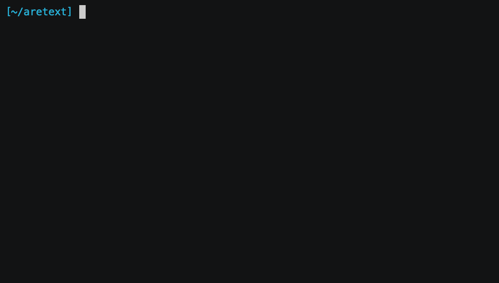

aretext
=======

Minimalist text editor with vim-compatible key bindings.

-	Simple and consistent terminal-based UI for distraction-free coding.
-	Efficient editing with over 100 vim commands.
-	Intuitive and flexible configuration, per language and project.
-	Seamless integration with CLI tools (bash, tmux, git, code formatters, compilers, and anything else you use).

*Aretext key bindings are compatible with vim's normal, insert, and visual modes. See [Command Reference](https://aretext.org/docs/command-reference/) for details.*

Getting Started
---------------

-	[Install](https://aretext.org/docs/install/)
-	[Quickstart](https://aretext.org/docs/quickstart/)
-	[User Documentation](https://aretext.org/docs/)
-	[Cheat Sheet](https://aretext.org/docs/cheat-sheet.html)

Project Status
--------------

-	The user interface is stable, and I am using it as my primary editor.
-	Syntax highlighting is available for [many languages](https://aretext.org/docs/config-reference/#syntax-languages), including Go, Python, Rust, and C.
-	Many important vim commands are supported, but there are still many more to add!

See [open milestones](https://github.com/aretext/aretext/milestones?direction=asc&sort=title&state=open) for the current roadmap.

Contributing
------------

Contributions are welcome! Please read the [Contribution Guidelines](CONTRIBUTING.md) to get started.

Developing
----------

See [DEVELOPING](DEVELOPING.md) for steps to build, test, and debug aretext.

Blog Posts and Talks
--------------------

-	[FOSDEM lightning talk (2022)](https://archive.fosdem.org/2022/schedule/event/lt_aretext/), also available [on youtube](https://www.youtube.com/watch?v=NJsWEnM5LcM).
-	[what's new in aretext 0.5](https://dev-nonsense.com/posts/aretext-0.5-release/)
-	[aretext 0.6 released!](https://dev-nonsense.com/posts/aretext-0.6-release/)
-	[aretext 0.7 release, thinking about 1.0](https://dev-nonsense.com/posts/aretext-0.7-release/)
-	[fuzzy find algorithm](https://dev-nonsense.com/posts/fuzzy-find-algorithm/)
-	[fuzzing the aretext markdown parser](https://dev-nonsense.com/posts/aretext-markdown-fuzz-test/)
-	[incremental parsing in go](https://dev-nonsense.com/posts/incremental-parsing-in-go/)

Copyright and License
---------------------

Copyright (C) 2021-2022 Will Daly

This program is free software: you can redistribute it and/or modify it under the terms of the GNU General Public License as published by the Free Software Foundation, either version 3 of the License, or (at your option) any later version.

This program is distributed in the hope that it will be useful, but WITHOUT ANY WARRANTY; without even the implied warranty of MERCHANTABILITY or FITNESS FOR A PARTICULAR PURPOSE. See the GNU General Public License for more details.

You should have received a copy of the GNU General Public License along with this program. If not, see https://www.gnu.org/licenses/.
